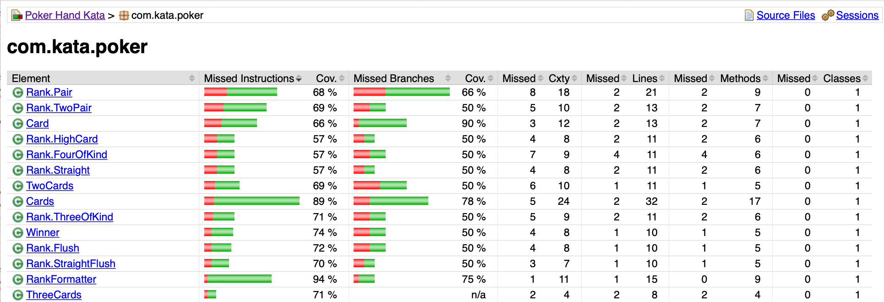
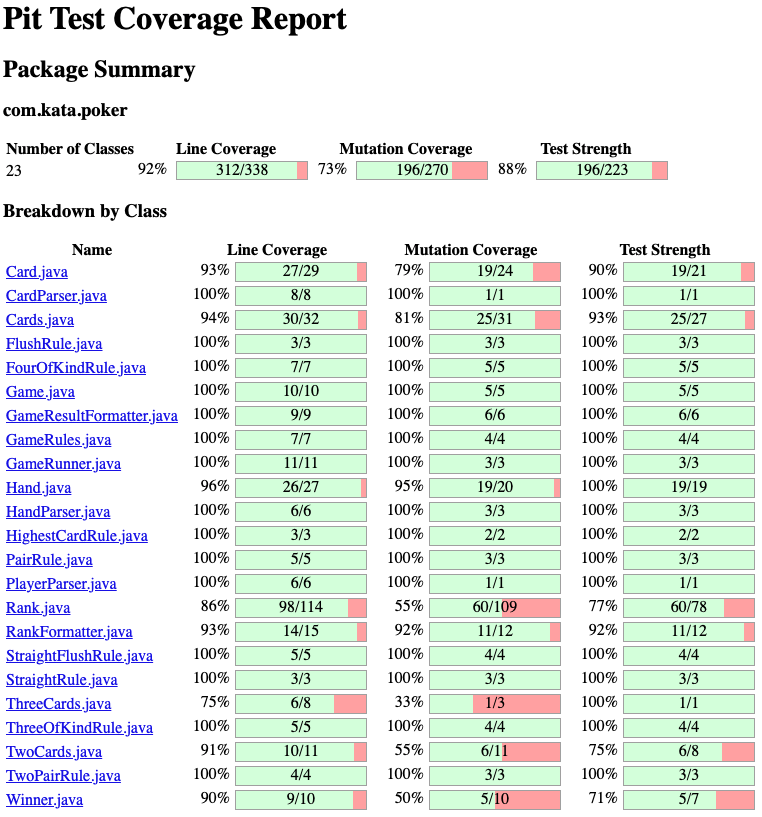
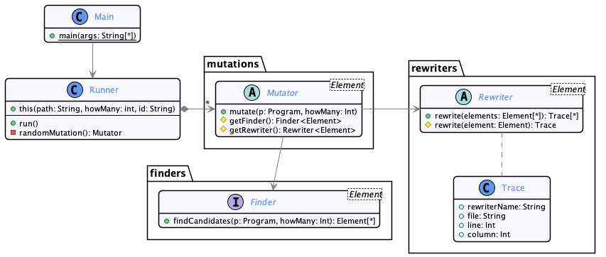

# Mutation Testing, Under the hood

  * Author: Sébastien Mosser (contact: [mosser.sebastien@uqam.ca](mosser.sebastien@uqam.ca))
  * Revision: 2021.03

# Introduction

## Repository contents

This repository is organized as the following:

  - `poker-hands-kata`: the _System Under Test_ considered in this lecture;
  - `src`: the source code of our mutation tool; 
  - `plantuml`: UML models describing the implementation, using the PlantUML tool (and associated PNG versions);
  - `docs`: a directory containing screenshots or additional resources;
  - `clean.sh`: a script to cleanup the directory;
  - `prof-x.sh`: the script implementing the complete business logic of our mutation testing framework.

## Requirements

To run this demo, you will need the following technological stack:

  - Java 11+
  - Maven 3.6+
  - A way to execute bash scripts (tested on Mac Os Big Sur)
  - Optional: a docker setup to run SonarQube

# Demonstration

## Step 0: Mutation Testing?

In a nutshell, mutation testing is an approach based on _fault injection_. To assess the quality of a test suite, we are voluntarily introducing bugs inside the _system under test_ (called a "_mutation_"), and we measure if the test suite manages to kill the mutants.

Mutation testing is a way to measure in a _quick_ way an approximate "confidence" on the test suite, complementing other metrics like line coverage or branch coverage.


## Step 1: Analyzing `poker-hands-kata`

To compile the project, run the following command:

```
mosser@loki poker-hands-kata % mvn -q clean package

-------------------------------------------------------
 T E S T S
-------------------------------------------------------
Running com.kata.poker.HandTest
Tests run: 5, Failures: 0, Errors: 0, Skipped: 0, Time elapsed: 0.072 sec
Running com.kata.poker.GameTest
Tests run: 39, Failures: 0, Errors: 0, Skipped: 0, Time elapsed: 0.044 sec
Running com.kata.poker.GameRulesTest
Tests run: 8, Failures: 0, Errors: 0, Skipped: 0, Time elapsed: 0.002 sec
Running com.kata.poker.TwoPairRuleTest
Tests run: 2, Failures: 0, Errors: 0, Skipped: 0, Time elapsed: 0 sec
Running com.kata.poker.GameRunnerTest
Tests run: 3, Failures: 0, Errors: 0, Skipped: 0, Time elapsed: 0.008 sec
Running com.kata.poker.GameResultFormatterTest
Tests run: 11, Failures: 0, Errors: 0, Skipped: 0, Time elapsed: 0.007 sec
Running com.kata.poker.RankTest
Tests run: 2, Failures: 0, Errors: 0, Skipped: 0, Time elapsed: 0 sec

Results :

Tests run: 70, Failures: 0, Errors: 0, Skipped: 0
```

### Computing Code Coverage

1. Compute **Ja**va **Co**de **Co**verage (*JaCoCo*):
    - `mvn org.jacoco:jacoco-maven-plugin:prepare-agent package org.jacoco:jacoco-maven-plugin:report`
2. Watch the results on the generated web page:
    - [target/site/jacoco/index.html](target/site/jacoco/index.html)



### Running SonarQube analysis

To run a standard analysis using SonarQube, run the following commands:

1. Starting SonarQube (requires Docker):
    - `docker run -d --name sonarqube -e SONAR_ES_BOOTSTRAP_CHECKS_DISABLE=true -p 9000:9000 sonarqube:lts`
2. Push the data to SonarQube for analysis:
    - `mvn sonar:sonar`
3. Watch the results through the web interface:
    - [http://localhost:9000/](http://localhost:9000/)


### Using PIT for mutation testing

Run PIT directly from Maven:

```
mosser@loki poker-hands-kata % mvn org.pitest:pitest-maven:mutationCoverage
...
================================================================================
- Statistics
================================================================================
>> Generated 270 mutations Killed 196 (73%)
>> Mutations with no coverage 47. Test strength 88%
>> Ran 528 tests (1.96 tests permutation)
```

To get a better view of the result, open the report in the `target/pit-report` directory.



## Step 2: Architectural design

To build our framework, we need:

  - `R1`: to keep it simple from a technological point of view;
  - `R2`: to apply mutations to Java code (_e.g._, a maven project)
  - `R3`: to create multiple mutants for the same project
  - `R4`: to control the amount of mutation in each mutant
  - `R5`: to trace the mutations
  - `R6`: to execute the test suite on the mutants
  - `R7`: to aggregate the results of the tests for each mutant


Based on these requirements, we design our framework as the following:

  - A Java tool (`R1`) to mutate a Maven project (`R2`), controlling the number of mutations (`R4`) and tracing them (`R5`);
  - A shell script (`R1`) to orchestrate the previous tool (`R3`), the test execution from the command line (`R6`) and the aggregation of results (`R7`).

## Step 3: Designing the mutation tool

### Identifying Responsibilities

To apply mutation to a program, we need the following responsibilities:

  - Find the spots where a mutation can be used;
  - Rewrite a concrete location to apply the mutation;
  - Trace which rewriting was applied where;
  - Read the configuration from the command line;

Based on these responsibilities, we propose the following design:

  - the `Main` class is a buffer between the external world and our code;
  - a `Runner` class is defined to (i) Load the program to be mutated, (ii) select a random mutator and (iii) apply it.
  - a `Mutator` class is used to enact the concrete mutations
  - a `Finder` class is defined to identify the program elements that are candidates for mutation
  - a `Rewriter` class is defined to replace the program elements with the mutated ones properly.

### UML version




To implement _finders_ and _rewriters_, one has to extend the `Finder` or `Rewriter` abstractions. To create a mutator, one can bind together the right finder with the right rewriter.

## Step 4: Implementing the abstract framework

To build the mutation tool, we will use [Spoon](https://spoon.gforge.inria.fr/), a state-of-the-art tool provided by Inria that supports Java source code manipulation.


### Creating the Maven project

```
mosser@loki mutation-demo % mkdir -p src/main/java
mosser@loki mutation-demo % touch pom.xml
```

In the [`pom.xml`](./pom.xml) file, we need to focus on two things: _(i)_ declaring Spoon as a dependency, and _(ii)_ use the `maven-exec` plugin to transform our project into an executable one and execute the `Main` class when invoked:

```xml
<!-- ... -->
<dependencies>
	<dependency>
	  <groupId>fr.inria.gforge.spoon</groupId>
	  <artifactId>spoon-core</artifactId>
	  <version>8.3.0</version>
	</dependency>
</dependencies>

<build>
	<plugins>
	  <plugin>
	    <groupId>org.codehaus.mojo</groupId>
	    <artifactId>exec-maven-plugin</artifactId>
	    <version>3.0.0</version>
	    <executions>
	      <execution><goals><goal>java</goal></goals></execution>
	    </executions>
	    <configuration>
	      <mainClass>Main</mainClass>
	    </configuration>
	  </plugin>
	</plugins>
</build>
<!-- ... -->
```

To check that everything is correct:

```
mosser@loki mutation-demo % mvn clean
```

We can now import the project in our favourite IDE as a Maven project.


### Create class `Main`

```java
public class Main {
    
    public static void main(String[] args) {
        // Extract CLI arguments
        String project = args[0];
        int howMany = Integer.parseInt(args[1]);
        String mutantId = args[2];

        // Run the mutation tool
        Runner runner = new Runner(project, howMany, mutantId);
        runner.run();
    }
}
```

### Create class `Runner`

```java
public class Runner {

    private String project;
    private int howMany;
    private String mutantId;

    public Runner(String project, int howMany, String mutantId) {
        this.project = project;
        this.howMany = howMany;
        this.mutantId = mutantId;
    }

    public void run() {
        Launcher program = new MavenLauncher(project, MavenLauncher.SOURCE_TYPE.APP_SOURCE);
        program.buildModel();
        
        Mutator<?> mutator = randomMutator();
        Set<Trace> results =  mutator.mutate(program, howMany);
        for(Trace t: results)
            System.out.println(mutantId+","+t);`
        program.prettyprint();
    }

    private Mutator<?> randomMutator() {
        return null; // TODO: Fix me
    }
}
```

### Create abstract class `Mutator`

```java
public abstract class Mutator<Element extends CtElement> {

    public Set<Trace> mutate(Launcher program, int howMany){
        Set<Element> found = getFinder().findCandidates(program, howMany);
        return getRewriter().rewrite(found, program.getFactory());
    }

    protected abstract Finder<Element> getFinder();
    protected abstract Rewriter<Element> getRewriter();
}
```

### Create interface `Finder`

```java
public interface Finder<Element extends CtElement> {

    public Set<Element> findCandidates(Launcher program, int howMany);
}
```

### Create abstract class `Rewriter`

```java
public abstract class Rewriter<Element extends CtElement> {

    public Set<Trace> rewrite(Set<Element> found, Factory factory) {
        return found.stream().map( e -> {
            this.rewrite(e, factory);
            return new Trace(this.getName(), e);
        }).collect(Collectors.toSet());
    }

    protected abstract void rewrite(Element e, Factory factory);
    protected abstract String getName();
}
```

### Create class `Trace`

```java
public class Trace {

    private final String rewriter;
    private final String file;
    private final int line;
    private final int column;

    public Trace(String name, CtElement e) {
        this.rewriter = name;
        this.file = e.getPosition().getFile().getName();
        this.line = e.getPosition().getLine();
        this.column = e.getPosition().getColumn();
    }

    @Override
    public String toString() {
        StringBuilder builder = new StringBuilder();
        builder.append(rewriter).append(",")
                .append(file).append(",")
                .append(line).append(",")
                .append(column);
        return builder.toString();
    }
}
```

### Summary: 6 classes, 95 lines of code

```
mosser@loki mutation-demo % mvn -q clean package
mosser@loki mutation-demo % cloc src            
       6 text files.
       6 unique files.                              
       0 files ignored.

github.com/AlDanial/cloc v 1.88  T=0.02 s (391.7 files/s, 8225.1 lines/s)
-------------------------------------------------------------------------------
Language                     files          blank        comment           code
-------------------------------------------------------------------------------
Java                             6             29              2             95
-------------------------------------------------------------------------------
SUM:                             6             29              2             95
-------------------------------------------------------------------------------
```

## Step 5: Time to play with Spoon

The framework we have defined in the previous step is almost independent of the technology used to inject the fault. The only dependencies are (i) the one to `Launcher` (the system under test) and (ii) the `CtElement` API to represent program elements.

### Our first mutator: `IntroduceNullPointer`

We can now leverage the abstractions we have defined to create our first mutation: the `IntroduceNullPointer` one.

The intention is the following:

  - Select a `return` instruction that does not return a primitive type;
  - Rewrite this instruction to return `null.`

### Creating the `ObjectReturn` finder

```java
public class ObjectReturn implements Finder<CtReturn<?>> {

    @Override
    public Set<CtReturn<?>> findCandidates(Launcher program, int howMany) {
        List<CtReturn<?>> queried =
                program.getModel().getRootPackage().filterChildren(
                (CtReturn<?> r) -> !r.getReturnedExpression().getType().isPrimitive()
        ).list();
        Collections.shuffle(queried);
        return queried.stream().limit(howMany).collect(Collectors.toSet());
    }
}
```

### Creating the `ReturnNull` rewriter

```java
public class ReturnNull extends Rewriter<CtReturn<?>> {
    @Override
    protected void rewrite(CtReturn<?> e, Factory factory) {
        CtCodeSnippetStatement snippet = factory.Core().createCodeSnippetStatement();
        snippet.setValue("return null");
        e.replace(snippet);
    }

    @Override
    protected String getName() {
        return "ReturnNull";
    }
}
```


### Creating and registering the `IntroduceNullPointer` mutator

```java
public class IntroduceNullPointer extends Mutator<CtReturn<?>> {
    @Override
    protected Finder<CtReturn<?>> getFinder() {
        return new ObjectReturn();
    }

    @Override
    protected Rewriter<CtReturn<?>> getRewriter() {
        return new ReturnNull();
    }
}
```

We can now _register_ this mutation in the `Runner` to make it available.

```java
public class Runner {
    // ...
    private Mutator<?> randomMutator() {
        return new IntroduceNullPointer();
    }
}
```

### Executing the tool on the `poker-hands-kata` project

```
mosser@loki mutation-demo % mvn -q clean package                                             
mosser@loki mutation-demo % mvn -q exec:java -Dexec.args="poker-hands-kata 10 demo" 2> /dev/null
demo,ReturnNull,RankFormatter.java,36,9
demo,ReturnNull,TwoCards.java,15,9
demo,ReturnNull,RankFormatter.java,21,9
demo,ReturnNull,Rank.java,32,9
demo,ReturnNull,GameRules.java,21,9
demo,ReturnNull,Rank.java,16,9
demo,ReturnNull,Winner.java,13,9
demo,ReturnNull,Rank.java,189,13
demo,ReturnNull,StraightRule.java,11,9
demo,ReturnNull,Rank.java,372,13
```

### Checking the mutated code

The initial code does not contain any `return null` instructions:

```
mosser@loki mutation-demo % cd poker-hands-kata 
mosser@loki poker-hands-kata % find . -name '*.java' | xargs grep "return null"
mosser@loki poker-hands-kata % cd ..
```

By default, _Spoon_ will generate the rewritten code in a `spooned` directory:

```
mosser@loki mutation-demo % cd spooned 
mosser@loki spooned % find . -name '*.java' | xargs grep "return null"
./com/kata/poker/Winner.java:        return null;
./com/kata/poker/Rank.java:        return null;
./com/kata/poker/Rank.java:        return null;
./com/kata/poker/Rank.java:            return null;
./com/kata/poker/Rank.java:            return null;
./com/kata/poker/GameRules.java:        return null;
./com/kata/poker/StraightRule.java:        return null;
./com/kata/poker/RankFormatter.java:        return null;
./com/kata/poker/RankFormatter.java:        return null;
./com/kata/poker/TwoCards.java:        return null;
mosser@loki spooned % cd ..
```

### Summary


## Step 6: Orchestrating the mutations

The mutation we designed during steps 4 and 5 is just half of the job. Now we know how to mutate a program, but we still have to generate multiple mutants, execute the tests, and collect the results.

To implement such an orchestration, we are using a Bash script named `prof-x.sh` that will run the following tasks:

1. Extract CLI parameters;
2. prepare the environment to host the mutants we will create;
3. prepare as many mutants as necessary
4. run the test suite on each mutant
5. extract the results

### Bash implementation

We first create the script and make it executable:

```
mosser@loki mutation-demo % touch prof-x.sh 
mosser@loki mutation-demo % chmod u+x prof-x.sh 
```

Create the orchestration skeleton:

```bash
#!/usr/bin/env bash

ORIGINAL=$1
HOW_MANY_MUTANTS=$2
HOW_MANY_MUTATIONS=$3

function main()
{
  prepare_environment
  prepare_mutants
  run_tests_on_mutants
  extract_results
}
```

#### Preparing the environment

We will store the mutants in a directory named ... `mutants`.

```bash
function prepare_environment()
{
  rm -rf spooned;
  mkdir -p mutants
}
```

#### Preparing the mutants

We will create as many mutants as necessary:

```bash
function prepare_mutants()
{
  echo -e "# Preparing Mutants \n"
  echo "ID, Mutation, File, Line, Column"
  for id in $(seq 1 $HOW_MANY_MUTANTS)
  do
    prepare_a_mutant $id
  done
}
```

To create a mutant, we copy the original project and replace the copied source code with the one located in the `spooned` directory after our rewriting tool's execution.

```bash
function prepare_a_mutant() # $1: mutant id
{
  cp -r $ORIGINAL "mutants/mutant_$1"
  rm -rf mutants/mutant_$1/src/main/java/*
  mvn -q exec:java -Dexec.args="$ORIGINAL $HOW_MANY_MUTATIONS mutants/mutant_$1" 2> /dev/null
  mv spooned/* mutants/mutant_$1/src/main/java/.
  rm -rf spooned
}
```

#### Run the tests on each mutant

```bash
function run_tests_on_mutants()
{
  echo -e "\n# Testing Mutants"
  for m in mutants/mutant_*
  do
    cd $m || exit 1
    echo "## Processing $m"
    mvn -q clean test > /dev/null 2>&1
    cd $OLDPWD || exit 1
  done
}
```
#### Extract results

Maven relies on _Surefire_ to execute the tests. The results of the test execution are stored in the following directory: `target/surefire-reports.

Here is how one of these reports looks like:

```
-------------------------------------------------------------------------------
Test set: com.kata.poker.TwoPairRuleTest
-------------------------------------------------------------------------------
Tests run: 2, Failures: 1, Errors: 1, Skipped: 0, Time elapsed: 0.001 sec <<< FAILURE!
```

We need to extract from these files: (i) the number of tests, (ii) the number of failures, and (iii) the number of errors. And to sum all these numbers to aggregate the values at the level of the mutant.

To do this, as bash is a constraint (limit the technological stack), we have to use a combination of:

  - `find` to find all the reports
  - `grep` to extract only the lines containing the test result information
  - `cut` to select the subpart of the line that includes the information we are looking for
  - a combination of `paste` and `bc` to sum all the results.

```bash
function extract_results()
{
  echo -e "\n# Extracting results \n"
  echo "ID, Tests, Failures, Errors"
  for m in mutants/mutant_*
  do
    cd $m || exit 1
    TESTS=$(find target/surefire-reports -name '*.txt' | xargs grep "Tests run" \
              | cut -d "," -f 1 | cut -d ':' -f 3 | paste -s -d+ - | bc
    )
    FAILURES=$(find target/surefire-reports -name '*.txt' | xargs grep "Tests run" \
              | cut -d "," -f 2 | cut -d ':' -f 2 | paste -s -d+ - | bc
    )
    ERRORS=$(find target/surefire-reports -name '*.txt' | xargs grep "Tests run" \
              | cut -d "," -f 3 | cut -d ':' -f 2 | paste -s -d+ - | bc
    )
    echo $m,$TESTS,$FAILURES,$ERRORS
    cd $OLDPWD || exit 1
  done
}
```


### Running the mutation tool

```
mosser@loki mutation-demo % ./prof-x.sh poker-hands-kata 4 1
# Preparing Mutants 

ID, Mutation, File, Line, Column
mutants/mutant_1,ReturnNull,Rank.java,234,13
mutants/mutant_2,ReturnNull,Rank.java,189,13
mutants/mutant_3,ReturnNull,TwoCards.java,19,9
mutants/mutant_4,ReturnNull,Rank.java,230,13


# Testing Mutants
## Processing mutants/mutant_1
## Processing mutants/mutant_2
## Processing mutants/mutant_3
## Processing mutants/mutant_4

# Extracting results 

ID, Tests, Failures, Errors
mutants/mutant_1,70,0,1
mutants/mutant_2,70,0,0
mutants/mutant_3,70,6,1
mutants/mutant_4,70,0,0
```
In this run, we were lucky: 

  - Two mutants (#2 and #4) are not killed by the tests and survived!
  - Two mutants were killed correctly by the test suite

### Summary

```
mosser@loki mutation-demo % cloc prof-x.sh 
       1 text file.
       1 unique file.                              
       0 files ignored.

github.com/AlDanial/cloc v 1.88  T=0.01 s (100.3 files/s, 7425.1 lines/s)
-------------------------------------------------------------------------------
Language                     files          blank        comment           code
-------------------------------------------------------------------------------
Bourne Shell                     1              9              0             65
-------------------------------------------------------------------------------
```

## Step 7: Introducing other mutations

It is now possible to introduce more mutators inside our framework, using the `Finder` and `Rewriter` abstractions defined previously. We will assess that the `Finder`s and `Rewriter`s' APIs are generic enough and can be reused by different `Mutator`s.

Here are some example of `Mutator's that can be defined using our framework:

  - `SwitchCondition`: flip a boolean expression to its opposite (_lesser than_ becomes _greater or equals_, ...)
  - `FixCondition`: transform a condition into a constant (`true` or `false`)
  - `AlwaysEquals`: transform an `equals` method to return always true
  - `SetTo42`: transform a literal integer value to `42`
  - `OffByOne`: Add or subtract one to a literal integer value.

You can also contribute new mutators by sending pull requests!

## Conclusions & Perspectives

With this presentation, we demonstrated that it is possible to easily create a mutation testing framework using a simple technological stack (Java and bash). It allowed us to show how it is possible to _mutate_ a program at the source code level and the abstractions necessary to support such a task in an object-oriented way.

If you're interested in mutation testing, this is just the first step, i.e., assessing that mutating a program and testing a mutant is possible. This work should be continued and strengthen according to different dimensions:

  - **Mutations selection**: for now, the tool applies each mutation independently. As a consequence, it might produce twice the same mutant. The mutations are also selected in a purely random way, leading to non-interesting mutants.
  - **Mutant equivalence**: When applying multiple mutations to the same program, we are not providing any guarantees for producing mutants that are not equivalent to the initial program. If not decidable in the general case (program equivalence is undecidable, it is a specific form of the halting problem), we can at least find a trade-off here to try not to generate equivalent programs on purpose. 
  - **Traceability**: we only trace which rewritings were applied and where. Adding extra semantics to this technical information and composing this source of information with the test coverage would allow one to know which mutation triggered which failure.
  - **Reporting**: We are using plain CSV documents to trace the mutation and describe the error for now. From an HCI point of view, finding a way to explore the results better, especially on significantly large software, would be beneficial.
  - **Performances**: the tooling relies on generating Maven projects and executing them independently. A better and more efficient approach would be to better integrate the mutations with the testing: in-memory testing (instead of generating Maven projects) and byte-code rewriting (instead of pretty-printing the whole application).


### Disclaimer

This code is provided as a demonstration of mutation testing internal mechanisms. It focuses on the essentials of mutation testing and neglects important elements like input sanitization, security, performance. As usual in software engineering, everything is about trade-offs.

### Blatant advertisement

Are you interested in code rewriting, software engineering and testing? Join the [ACE research group](https://ace-design.github.io) as a summer intern to work on related topics applied to micro-services and compilers.
